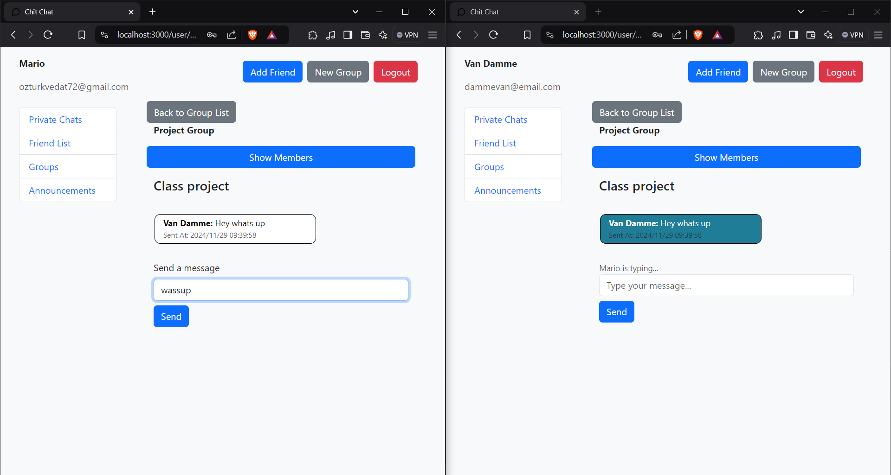

# ChitChat Frontend

## Overview

This project is the front-end for the ChitChat real-time chat application, built with ReactJS and styled with Bootstrap. It communicates with backend via SignalR for real-time updates and Axios for RESTful API interactions.

## Features

- **Real-Time Messaging**: Instant messaging updates and notifications via SignalR WebSockets.
- **User Authentication**: Integrates with backend's JWT-based authetication and refresh token mechanisms.
- **Responsive UI**: Built with Bootstrap for a better UX.
- **REST API Integration**: Uses Axios to interact with the back-end's API for user, group, and chat management.

## Setting Up

### Prerequisites

- [Node.js](https://nodejs.org/en/download/package-manager)
- [npm](https://docs.npmjs.com/downloading-and-installing-node-js-and-npm) (comes with node.js)
  
### Installation

1. Clone the repository:

   ```bash
   git clone https://github.com/OzturkVedat/RealTimeChatApp_Frontend.git
   cd RealTimeChatApp_Frontend
   ```

2. Install dependencies:

    ```bash
    npm install
    ```

3. Configure enviroment variables:
   Create a .env file in the root directory. Add the back-end API and Hub URLs. For example:

    ```bash
    VITE_API_BASE_URL=https://localhost:7210/api
    VITE_HUB_BASE_URL=https://localhost:7210/hub
    ```
4. Switch to HTTPS (optional but recommended):
   Create a cert folder in the root directory of project. Obtain self-signed certificate for local development (e.g. via mkcert) and place certificate files (cert.pem and key.pem) in cert folder. Modify the vite.config.js file to use the certificates:
     ```bash
    https: {
      key: fs.readFileSync('./cert/key.pem'),
      cert: fs.readFileSync('./cert/cert.pem'),
    },
    ```
   
6. Run the development server:
   
     ```bash
    npm run dev
    ```
       
7. Open your browser and navigate to:
    http://localhost:3000
    https://localhost:3000

Note: For end-to-end experience, run the [back-end](https://github.com/OzturkVedat/RealTimeChatApp_Backend) of the app.    

    
### UI Preview




## Contributing
Feel free to open issues or submit pull requests for improvements, bug fixes, or new features.
